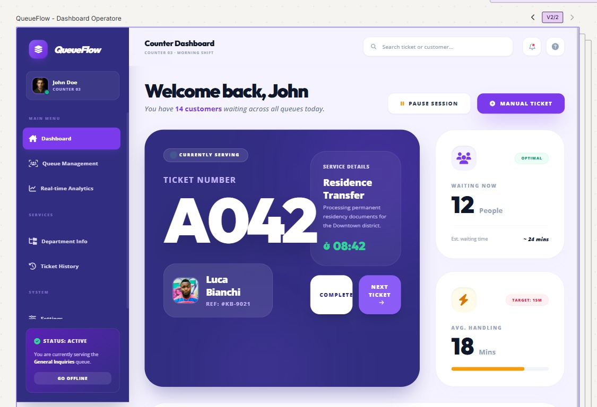

# SE2 Office Queue Management (Team09)

This repository contains the initial project scaffold for the Office Queue Management system.

The project is organized with a clear separation between frontend, backend, and supporting areas (shared code, docs, infrastructure, scripts).

At this stage, the repository includes only the base structure and dependencies setup, with no business logic implemented yet.

## Tech Stack

- Frontend: React + Vite + classic CSS
- Backend: Node.js + Express
- Database: SQLite

## Repository Structure

```text
SE2-OfficeQueueManagement-Team09/
|-- apps/
|   |-- frontend/
|   |   |-- index.html
|   |   |-- package.json
|   |   |-- vite.config.js
|   |   `-- src/
|   |       |-- App.jsx
|   |       |-- main.jsx
|   |       |-- components/
|   |       |   `-- .gitkeep
|   |       `-- styles/
|   |           |-- app.css
|   |           `-- reset.css
|   `-- backend/
|       |-- .env.example
|       |-- package.json
|       |-- data/
|       |   `-- .gitkeep
|       `-- src/
|           |-- app.js
|           |-- server.js
|           |-- controllers/
|           |   `-- .gitkeep
|           |-- database/
|           |   `-- connection.js
|           |-- middlewares/
|           |   `-- .gitkeep
|           |-- routes/
|           |   `-- .gitkeep
|           `-- services/
|               `-- .gitkeep
|-- packages/
|   `-- shared/
|       |-- package.json
|       |-- README.md
|       `-- src/
|           |-- index.js
|           `-- .gitkeep
|-- docs/
|   |-- README.md
|   `-- .gitkeep
|-- infra/
|   |-- README.md
|   `-- .gitkeep
|-- scripts/
|   |-- README.md
|   `-- .gitkeep
|-- .gitignore
`-- README.md
```

## Folder Responsibilities

- Frontend app: `apps/frontend`
- Backend app: `apps/backend`
- Shared code area: `packages/shared`
- Documentation: `docs`
- Infrastructure and deployment files: `infra`
- Workspace helper scripts: `scripts`

## Prerequisites

- Node.js (latest LTS recommended)
- npm

## Install Dependencies

Run from the repository root.

### 1) Frontend

```bash
cd apps/frontend
npm install
```

### 2) Backend

```bash
cd ../backend
npm install
```

## Run Locally

Use two separate terminals.

### Terminal 1 - Backend

```bash
cd apps/backend
npm run dev
```

Backend API runs on: `http://localhost:4000`

### Terminal 2 - Frontend

```bash
cd apps/frontend
npm run dev
```

Frontend runs on: `http://localhost:5173`

## Available Scripts

### Frontend (`apps/frontend`)

- `npm run dev` starts Vite in development mode
- `npm run build` creates a production build
- `npm run preview` previews the production build

### Backend (`apps/backend`)

- `npm run dev` starts Express with nodemon
- `npm start` starts Express with node

## Environment Notes

- Create `apps/backend/.env` from `apps/backend/.env.example` for local configuration.
- The SQLite database file will be created under `apps/backend/data/` when the database layer is initialized.
- This repository currently contains only the scaffold and setup files.

## Figma Prototype Documentation

The visual prototype for this project is available in the `figmaPrototype` folder.

- Full documentation: [figmaPrototype/README.md](figmaPrototype/README.md)
- Prototype assets: [figmaPrototype](figmaPrototype)

### Quick Preview

Operator dashboard reference screen:



### Validation Summary

The prototype is valid as a strong visual and UX baseline for the MVP.

- Good visual hierarchy and clear information architecture
- Consistent component language across operator, kiosk, public display, and admin views
- Good flow coverage for core queue-management operations
- Real-time metrics and status indicators are clearly represented

Before implementation, it is recommended to finalize:

- Mobile and tablet responsive variants
- Accessibility constraints (contrast, focus states, minimum font sizes)
- Clean exports without editor overlays for final handoff
