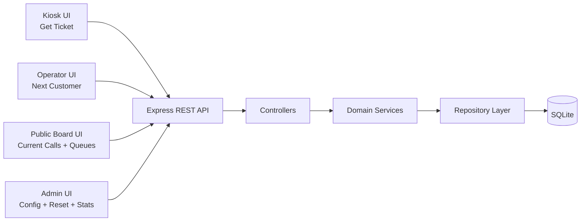

# Office Queue Management - Architecture Design

## 1. Scope

This document defines the target backend architecture for the MVP queue system:

- ticket issuance
- next customer call per counter
- public board status
- queue length visualization
- operational statistics
- admin configuration of counters and services

## 2. High-Level Architecture



## 3. Backend Layering (apps/backend/src)

- `routes/`: endpoint mapping and request validation hooks
- `controllers/`: HTTP concerns (status code, request/response mapping)
- `services/`: business rules, transaction orchestration
- `database/`: connection and SQL repository functions
- `middlewares/`: error handling, request validation, logging

## 4. API Design Notes

The endpoint set you proposed is coherent for MVP and maps well to the stories.
Main consistency recommendations:

- Keep naming consistent (`service_id`, `counter_id`, `issued_at`, etc.).
- Keep semantic clarity on timestamps:
  - `issued_at`: when the ticket is created.
  - `called_at`: when a counter calls the ticket.
  - `completed_at` (optional but recommended): when service actually finishes.
- Keep `POST /api/counters/{id}/next` idempotency behavior clear:
  - if no waiting ticket for services assigned to counter -> `204 No Content`.

## 5. Data Model

## 5.1 Core Tables

```sql
CREATE TABLE services (
  id INTEGER PRIMARY KEY AUTOINCREMENT,
  name TEXT NOT NULL UNIQUE,
  requested_time INTEGER NOT NULL CHECK (requested_time > 0),
  created_at TEXT NOT NULL DEFAULT (datetime('now')),
  updated_at TEXT NOT NULL DEFAULT (datetime('now'))
);

CREATE TABLE counters (
  id INTEGER PRIMARY KEY AUTOINCREMENT,
  name TEXT NOT NULL UNIQUE,
  created_at TEXT NOT NULL DEFAULT (datetime('now')),
  updated_at TEXT NOT NULL DEFAULT (datetime('now'))
);

CREATE TABLE counters_services (
  id INTEGER PRIMARY KEY AUTOINCREMENT,
  counter_id INTEGER NOT NULL,
  service_id INTEGER NOT NULL,
  FOREIGN KEY (counter_id) REFERENCES counters(id) ON DELETE CASCADE,
  FOREIGN KEY (service_id) REFERENCES services(id) ON DELETE RESTRICT,
  UNIQUE (counter_id, service_id)
);

CREATE TABLE tickets (
  id INTEGER PRIMARY KEY AUTOINCREMENT,
  service_id INTEGER NOT NULL,
  counter_id INTEGER,
  status TEXT NOT NULL DEFAULT 'WAITING'
    CHECK (status IN ('WAITING', 'CALLED', 'COMPLETED', 'CANCELLED')),
  issued_at TEXT NOT NULL DEFAULT (datetime('now')),
  called_at TEXT,
  completed_at TEXT,
  FOREIGN KEY (service_id) REFERENCES services(id) ON DELETE RESTRICT,
  FOREIGN KEY (counter_id) REFERENCES counters(id) ON DELETE SET NULL
);
```

## 5.2 Answer to "Does `tickets: id_service, id_counter, issue_at, served_at` make sense?"

Yes, it mostly makes sense.

Recommended adjustment:

- Keep `service_id` and nullable `counter_id` exactly as you proposed.
- Rename `served_at` to `called_at` for precision (the `next` operation is a call event).
- Add `completed_at` if you need real "customer served" completion tracking.
- Add a `status` column to avoid ambiguous interpretation of NULL timestamps.

Without `status`, nullability rules become harder to reason about and statistics are less reliable.

## 5.3 Useful Indexes

```sql
CREATE INDEX idx_tickets_waiting_by_service
  ON tickets(service_id, status, issued_at);

CREATE INDEX idx_tickets_called_by_counter
  ON tickets(counter_id, status, called_at);

CREATE INDEX idx_tickets_issued_at
  ON tickets(issued_at);
```

## 6. Story-to-Endpoint Mapping

- Get a ticket
  - `GET /api/services`
  - `POST /api/tickets`
- Next customer
  - `POST /api/counters/{id}/next`
- Call customer / public board
  - `GET /api/counters/current`
- View queue lengths
  - `GET /api/queues`
- Stats
  - `GET /api/stats?period={daily|weekly|monthly}&date={YYYY-MM-DD}`
- Config counters/services
  - `POST /api/queues/reset`
  - `GET/POST/PUT/DELETE /api/counters`
  - `GET/POST/PUT/DELETE /api/services`
- Estimated waiting time
  - `GET /api/tickets/{id}/waiting-time`

Note: if you truly want `{code}` instead of DB id, add a dedicated `ticket_code` column.

## 7. Critical Business Flows

## 7.1 Create ticket

1. Validate `service_id` exists.
2. Insert ticket with `status='WAITING'` and `issued_at=now`.
3. Return created ticket (`201`).

## 7.2 Call next ticket (`POST /api/counters/{id}/next`)

Run inside one DB transaction:

1. Verify counter exists.
2. Read services assigned to counter from `counters_services`.
3. Select oldest waiting ticket for those services.
4. If no rows -> `204`.
5. Update selected ticket:
   - `counter_id = {id}`
   - `status = 'CALLED'`
   - `called_at = now`
6. Return updated ticket (`200`).

This transactional pattern avoids race conditions when two operators call next almost simultaneously.

## 8. Queue Length and ETA Rules

## 8.1 Queue length

For each service:

- queue length = count of tickets where `status='WAITING'` and `service_id = X`.

## 8.2 Estimated waiting time

For ticket T:

- `people_in_queue` = waiting tickets of same service issued before T.
- `active_counters_for_service` = counters assigned to that service.
- `avg_service_time` = `services.requested_time`.

Suggested formula:

$$
ETA_{minutes} = \frac{people\_in\_queue + 1}{\max(active\_counters\_for\_service, 1)} \times avg\_service\_time
$$

## 9. Error Contract (Recommended)

Current payloads are already valid. For long-term consistency, consider this shape:

```json
{
  "error": {
    "code": "COUNTER_NOT_FOUND",
    "message": "Counter not found."
  }
}
```

This simplifies frontend logic and localization.

## 10. Optional Enhancements

- Add `ticket_events` table for audit and richer analytics.
- Add soft-delete (`is_active`) for services/counters instead of hard delete.
- Add optimistic lock/version on tickets if concurrency grows.

## 11. MVP Verdict

Your API set is well-structured for the stories.
The only major refinement is to make ticket lifecycle explicit (`status`, `called_at`, optional `completed_at`), which resolves ambiguity and improves stats accuracy.
