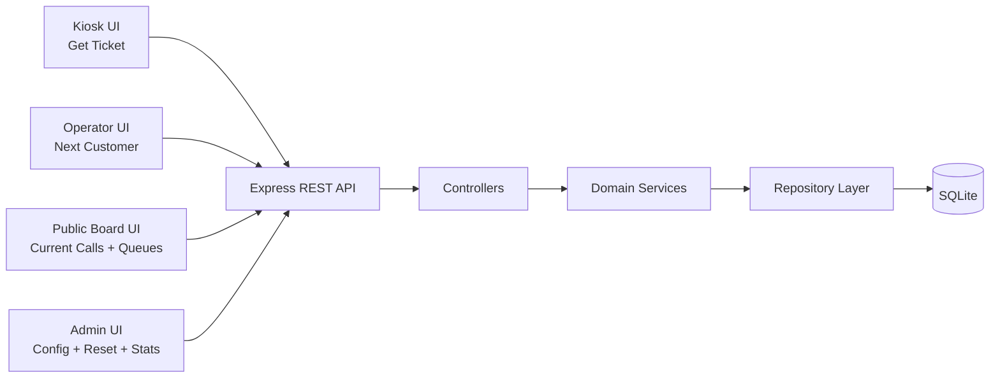

# Office Queue Management - Architecture Design

## 1. Scope

This document defines the target backend architecture for the MVP queue system:

- ticket issuance
- next customer call per counter
- public board status
- queue length visualization
- operational statistics
- admin configuration of counters and services

## 2. High-Level Architecture



## 3. Backend Layering (apps/backend/src)

- `routes/`: endpoint mapping and request validation hooks
- `controllers/`: HTTP concerns (status code, request/response mapping)
- `services/`: business rules, transaction orchestration
- `database/`: connection and SQL repository functions
- `middlewares/`: error handling, request validation, logging

## 4. API Design (per story)

### Get a ticket

- **GET /api/services**: returns all the services.
  - **Request Body**: *None*
  - **Response (200 OK)**:
    ```json
    [
      {
        "id": 1,
        "name": "shipping",
        "processing_time": 5,
        "counter_list": [1, 2]
      },
      {
        "id": 2,
        "name": "accounts",
        "processing_time": 3,
        "counter_list": [1]
      }
    ]
    ```
  - **Error Responses**:
    - **500 Internal Server Error**:
      ```json
      {
        "error": {
          "code": "INTERNAL_SERVER_ERROR",
          "message": "Internal server error occurred while retrieving services."
        }
      }
      ```

- **POST /api/tickets**: create a new ticket for the selected service.
  - **Request Body**:
    ```json
    {
      "id_service": 1
    }
    ```
  - **Response (201 Created)**:
    ```json
    {
      "id": 1,
      "code": "A101",
      "id_service": 1,
      "id_counter": null,
      "issue_at": "2026-10-08T09:30:00Z",
      "served_at": null,
      "status": "WAITING"
    }
    ```
  - **Error Responses**:
    - **400 Bad Request**:
      ```json
      {
        "error": {
          "code": "INVALID_INPUT",
          "message": "Invalid input: id_service must be a valid integer."
        }
      }
      ```
    - **404 Not Found**:
      ```json
      {
        "error": {
          "code": "SERVICE_NOT_FOUND",
          "message": "Service not found."
        }
      }
      ```
    - **500 Internal Server Error**:
      ```json
      {
        "error": {
          "code": "INTERNAL_SERVER_ERROR",
          "message": "Internal server error occurred while creating the ticket."
        }
      }
      ```

### Next customer

- **POST /api/counters/{id}/next**: returns the next ticket code that will be served.
  - **Request Body**: *None*
  - **Response (200 OK)**:
    ```json
    {
      "id": 1,
      "code": "A101",
      "id_service": 1,
      "id_counter": 1,
      "issue_at": "2026-10-08T09:30:00Z",
      "served_at": "2026-10-08T09:45:00Z",
      "status": "SERVED"
    }
    ```
  - **Response (204 No Content)**:
    *(No response body returned if all queues served by the counter are empty)*
  - **Error Responses**:
    - **400 Bad Request**:
      ```json
      {
        "error": {
          "code": "INVALID_INPUT",
          "message": "Invalid counter ID supplied."
        }
      }
      ```
    - **401 Unauthorized**:
      ```json
      {
        "error": {
          "code": "UNAUTHORIZED",
          "message": "Authentication required to perform this action."
        }
      }
      ```
    - **404 Not Found**:
      ```json
      {
        "error": {
          "code": "COUNTER_NOT_FOUND",
          "message": "Counter not found."
        }
      }
      ```
    - **500 Internal Server Error**:
      ```json
      {
        "error": {
          "code": "INTERNAL_SERVER_ERROR",
          "message": "Internal server error occurred while calling the next ticket."
        }
      }
      ```

### Call customer

- **GET /api/counters/current**: returns the current served ticket code for each counter.
  - **Request Body**: *None*
  - **Response (200 OK)**:
    ```json
    [
      {
        "id_counter": 1,
        "ticket_code": "A101",
        "service_name": "shipping"
      },
      {
        "id_counter": 2,
        "ticket_code": null,
        "service_name": null
      }
    ]
    ```
  - **Error Responses**:
    - **500 Internal Server Error**:
      ```json
      {
        "error": {
          "code": "INTERNAL_SERVER_ERROR",
          "message": "Internal server error occurred while retrieving current counter status."
        }
      }
      ```

### View queue lengths

- **GET /api/queues**: returns the current queue length (number of waiting customers) for each service type to be displayed on the main board.
  - **Request Body**: *None*
  - **Response (200 OK)**:
    ```json
    [
      {
        "id_service": 1,
        "service_name": "shipping",
        "queue_length": 4
      },
      {
        "id_service": 2,
        "service_name": "accounts",
        "queue_length": 0
      }
    ]
    ```
  - **Error Responses**:
    - **500 Internal Server Error**:
      ```json
      {
        "error": {
          "code": "INTERNAL_SERVER_ERROR",
          "message": "Internal server error occurred while retrieving queue lengths."
        }
      }
      ```

### See stats

- **GET /api/stats?period={daily|weekly|monthly}&date={YYYY-MM-DD}**: returns the statistics for the specified period.
  - **Request Body**: *None*
  - **Response (200 OK)**:
    ```json
    {
      "period": "daily",
      "date": "2026-10-08",
      "services_stats": [
        {
          "id_service": 1,
          "service_name": "shipping",
          "customers_served": 45
        },
        {
          "id_service": 2,
          "service_name": "accounts",
          "customers_served": 30
        }
      ],
      "counters_stats": [
        {
          "id_counter": 1,
          "counter_number": 1,
          "served_by_service": [
            {
              "id_service": 1,
              "service_name": "shipping",
              "customers_served": 25
            },
            {
              "id_service": 2,
              "service_name": "accounts",
              "customers_served": 15
            }
          ]
        }
      ]
    }
    ```
  - **Error Responses**:
    - **400 Bad Request**:
      ```json
      {
        "error": {
          "code": "INVALID_INPUT",
          "message": "Invalid query parameters: period must be 'daily', 'weekly', or 'monthly', and date must be formatted as YYYY-MM-DD."
        }
      }
      ```
    - **401 Unauthorized**:
      ```json
      {
        "error": {
          "code": "UNAUTHORIZED",
          "message": "Authentication required to access statistics."
        }
      }
      ```
    - **500 Internal Server Error**:
      ```json
      {
        "error": {
          "code": "INTERNAL_SERVER_ERROR",
          "message": "Internal server error occurred while compiling statistics."
        }
      }
      ```

### Config counters

- **POST /api/queues/reset**: resets all the queues.
  - **Request Body**: *None*
  - **Response (200 OK)**:
    ```json
    {
      "message": "All queues have been successfully reset."
    }
    ```
  - **Error Responses**:
    - **401 Unauthorized**:
      ```json
      {
        "error": {
          "code": "UNAUTHORIZED",
          "message": "Authentication required to reset queues."
        }
      }
      ```
    - **500 Internal Server Error**:
      ```json
      {
        "error": {
          "code": "INTERNAL_SERVER_ERROR",
          "message": "Internal server error occurred while resetting queues."
        }
      }
      ```

- **GET /api/counters**: returns all the counters.
  - **Request Body**: *None*
  - **Response (200 OK)**:
    ```json
    [
      {
        "id": 1,
        "number": 1,
        "services": [1, 2]
      },
      {
        "id": 2,
        "number": 2,
        "services": [1]
      }
    ]
    ```
  - **Error Responses**:
    - **401 Unauthorized**:
      ```json
      {
        "error": {
          "code": "UNAUTHORIZED",
          "message": "Authentication required to view configuration."
        }
      }
      ```
    - **500 Internal Server Error**:
      ```json
      {
        "error": {
          "code": "INTERNAL_SERVER_ERROR",
          "message": "Internal server error occurred while fetching counters."
        }
      }
      ```

- **POST /api/counters**: creates a new counter.
  - **Request Body**:
    ```json
    {
      "number": 3,
      "services": [1, 2]
    }
    ```
  - **Response (201 Created)**:
    ```json
    {
      "id": 3,
      "number": 3,
      "services": [1, 2]
    }
    ```
  - **Error Responses**:
    - **400 Bad Request**:
      ```json
      {
        "error": {
          "code": "INVALID_INPUT",
          "message": "Invalid counter data: number is required and services must be a list of existing service IDs."
        }
      }
      ```
    - **401 Unauthorized**:
      ```json
      {
        "error": {
          "code": "UNAUTHORIZED",
          "message": "Authentication required to create a counter."
        }
      }
      ```
    - **500 Internal Server Error**:
      ```json
      {
        "error": {
          "code": "INTERNAL_SERVER_ERROR",
          "message": "Internal server error occurred while creating the counter."
        }
      }
      ```

- **PUT /api/counters/{id}**: update a specific counter.
  - **Request Body**:
    ```json
    {
      "number": 1,
      "services": [2]
    }
    ```
  - **Response (200 OK)**:
    ```json
    {
      "id": 1,
      "number": 1,
      "services": [2]
    }
    ```
  - **Error Responses**:
    - **400 Bad Request**:
      ```json
      {
        "error": {
          "code": "INVALID_INPUT",
          "message": "Invalid counter data or format provided."
        }
      }
      ```
    - **401 Unauthorized**:
      ```json
      {
        "error": {
          "code": "UNAUTHORIZED",
          "message": "Authentication required to update a counter."
        }
      }
      ```
    - **404 Not Found**:
      ```json
      {
        "error": {
          "code": "COUNTER_NOT_FOUND",
          "message": "Counter not found."
        }
      }
      ```
    - **500 Internal Server Error**:
      ```json
      {
        "error": {
          "code": "INTERNAL_SERVER_ERROR",
          "message": "Internal server error occurred while updating the counter."
        }
      }
      ```

- **DELETE /api/counters/{id}**: delete a specific counter.
  - **Request Body**: *None*
  - **Response (200 OK)**:
    ```json
    {
      "message": "Counter 1 successfully deleted."
    }
    ```
  - **Error Responses**:
    - **400 Bad Request**:
      ```json
      {
        "error": {
          "code": "INVALID_INPUT",
          "message": "Invalid counter ID supplied."
        }
      }
      ```
    - **401 Unauthorized**:
      ```json
      {
        "error": {
          "code": "UNAUTHORIZED",
          "message": "Authentication required to delete a counter."
        }
      }
      ```
    - **404 Not Found**:
      ```json
      {
        "error": {
          "code": "COUNTER_NOT_FOUND",
          "message": "Counter not found."
        }
      }
      ```
    - **500 Internal Server Error**:
      ```json
      {
        "error": {
          "code": "INTERNAL_SERVER_ERROR",
          "message": "Internal server error occurred while deleting the counter."
        }
      }
      ```

- **GET /api/services**: returns all the services (already in **get ticket** story).
  - *(Refer to "Get a ticket" story)*

- **POST /api/services**: creates a new service.
  - **Request Body**:
    ```json
    {
      "name": "packages",
      "processing_time": 10
    }
    ```
  - **Response (201 Created)**:
    ```json
    {
      "id": 3,
      "name": "packages",
      "processing_time": 10,
      "counter_list": []
    }
    ```
  - **Error Responses**:
    - **400 Bad Request**:
      ```json
      {
        "error": {
          "code": "INVALID_INPUT",
          "message": "Invalid service data: name must be a non-empty string and processing_time must be a positive integer."
        }
      }
      ```
    - **401 Unauthorized**:
      ```json
      {
        "error": {
          "code": "UNAUTHORIZED",
          "message": "Authentication required to create a service."
        }
      }
      ```
    - **409 Conflict**:
      ```json
      {
        "error": {
          "code": "CONFLICT",
          "message": "A service with this name already exists."
        }
      }
      ```
    - **500 Internal Server Error**:
      ```json
      {
        "error": {
          "code": "INTERNAL_SERVER_ERROR",
          "message": "Internal server error occurred while creating the service."
        }
      }
      ```

- **PUT /api/services/{id}**: update a specific service.
  - **Request Body**:
    ```json
    {
      "name": "shipping express",
      "processing_time": 4
    }
    ```
  - **Response (200 OK)**:
    ```json
    {
      "id": 1,
      "name": "shipping express",
      "processing_time": 4,
      "counter_list": [1, 2]
    }
    ```
  - **Error Responses**:
    - **400 Bad Request**:
      ```json
      {
        "error": {
          "code": "INVALID_INPUT",
          "message": "Invalid service payload provided."
        }
      }
      ```
    - **401 Unauthorized**:
      ```json
      {
        "error": {
          "code": "UNAUTHORIZED",
          "message": "Authentication required to update a service."
        }
      }
      ```
    - **404 Not Found**:
      ```json
      {
        "error": {
          "code": "SERVICE_NOT_FOUND",
          "message": "Service not found."
        }
      }
      ```
    - **500 Internal Server Error**:
      ```json
      {
        "error": {
          "code": "INTERNAL_SERVER_ERROR",
          "message": "Internal server error occurred while updating the service."
        }
      }
      ```

- **DELETE /api/services/{id}**: delete a specific service.
  - **Request Body**: *None*
  - **Response (200 OK)**:
    ```json
    {
      "message": "Service 1 successfully deleted."
    }
    ```
  - **Error Responses**:
    - **400 Bad Request**:
      ```json
      {
        "error": {
          "code": "INVALID_INPUT",
          "message": "Invalid service ID supplied."
        }
      }
      ```
    - **401 Unauthorized**:
      ```json
      {
        "error": {
          "code": "UNAUTHORIZED",
          "message": "Authentication required to delete a service."
        }
      }
      ```
    - **404 Not Found**:
      ```json
      {
        "error": {
          "code": "SERVICE_NOT_FOUND",
          "message": "Service not found."
        }
      }
      ```
    - **409 Conflict**:
      ```json
      {
        "error": {
          "code": "CONFLICT",
          "message": "Cannot delete service: service is currently assigned to one or more counters."
        }
      }
      ```
    - **500 Internal Server Error**:
      ```json
      {
        "error": {
          "code": "INTERNAL_SERVER_ERROR",
          "message": "Internal server error occurred while deleting the service."
        }
      }
      ```

### Get estimated time

- **GET /api/tickets/{code}/waiting-time**: returns the estimated waiting time.
  - **Request Body**: *None*
  - **Response (200 OK)**:
    ```json
    {
      "ticket_code": "A101",
      "id_service": 1,
      "people_in_queue": 4,
      "estimated_waiting_time_minutes": 15.83
    }
    ```
  - **Error Responses**:
    - **400 Bad Request**:
      ```json
      {
        "error": {
          "code": "INVALID_INPUT",
          "message": "Invalid ticket code parameter."
        }
      }
      ```
    - **404 Not Found**:
      ```json
      {
        "error": {
          "code": "TICKET_NOT_FOUND",
          "message": "Ticket not found."
        }
      }
      ```
    - **500 Internal Server Error**:
      ```json
      {
        "error": {
          "code": "INTERNAL_SERVER_ERROR",
          "message": "Internal server error occurred while calculating waiting time."
        }
      }
      ```

### Notify customer served

- **POST /api/counters/{id}/next**: returns the next ticket code that will be served. (already in **next customer** story)
  - *(Refer to "Next customer" story)*

## 5. DB schema

- counters: **id**, number
- services: **id**, name, processing_time
- counters_services: **id**, *id_counter*, *id_service*
- tickets: **id**, code, *id_service*, *id_counter*, issue_at, served_at, status  
  Note: status can be WAITING, SERVING or SERVED
- users: **id**, username, type, password, salt