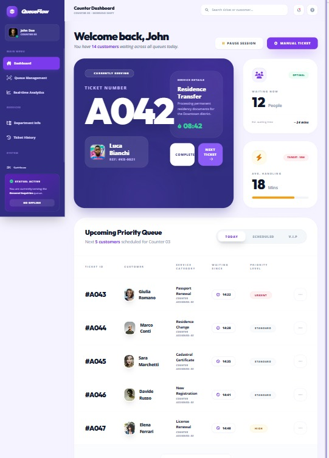
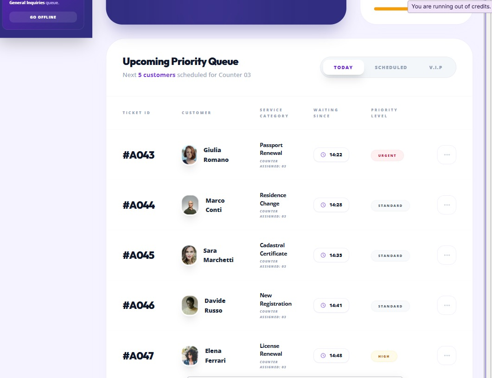
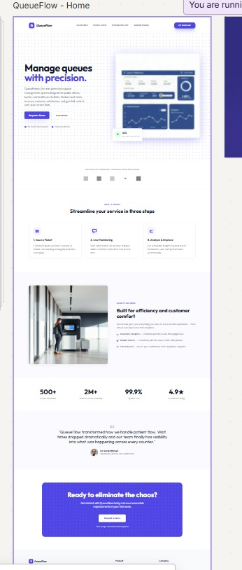
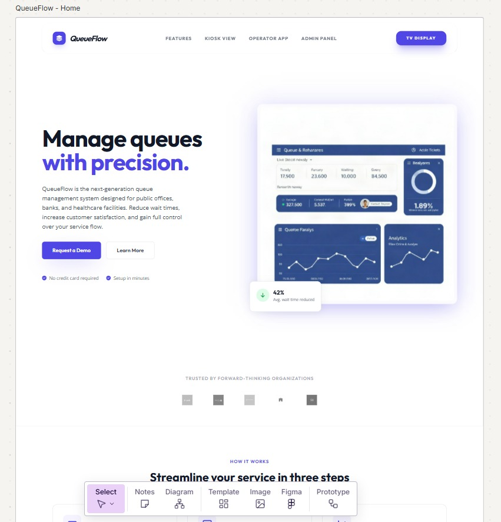
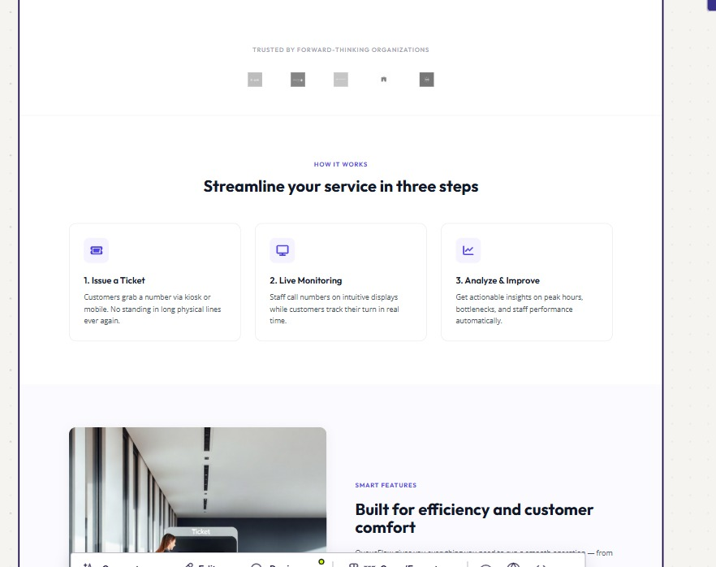
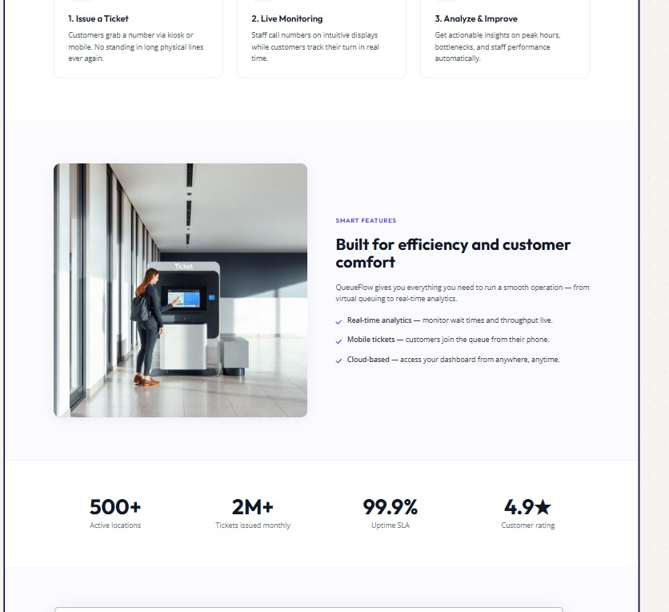
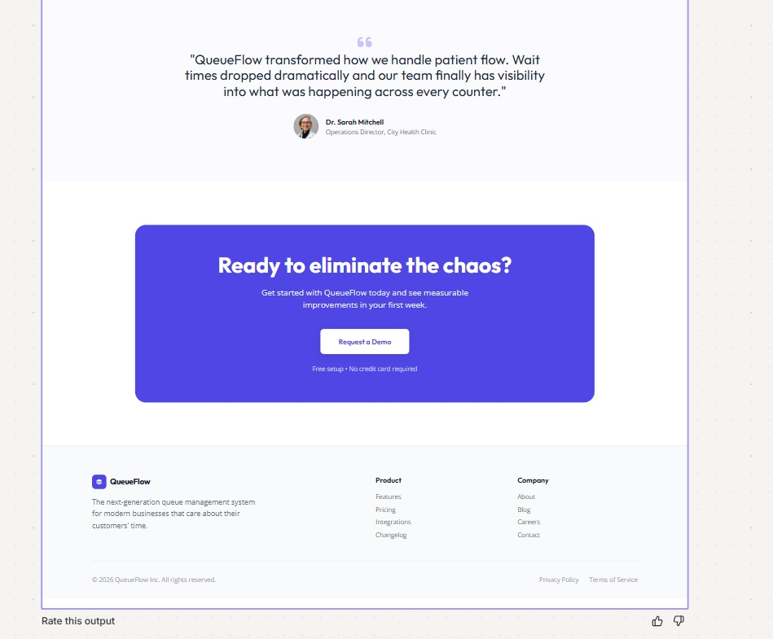
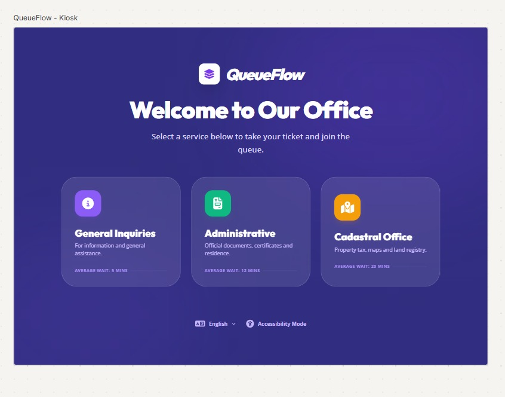
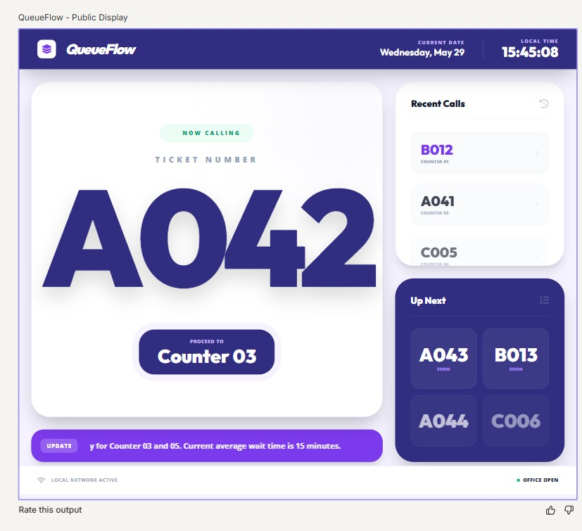
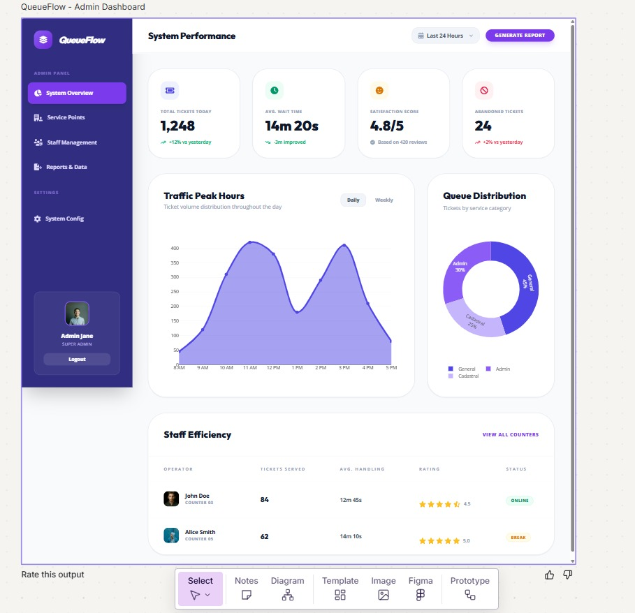

# Figma Prototype

Questa cartella contiene la documentazione visiva del prototipo QueueFlow.

## Obiettivo del prototipo

Il prototipo serve a validare la UX del sistema di gestione code prima della fase di sviluppo.
Copre i principali punti di contatto:

- Landing e presentazione prodotto
- Kiosk per emissione ticket
- Dashboard operatore allo sportello
- Public display per le chiamate
- Dashboard amministrativa per monitoraggio e report

## Valutazione rapida

Il prototipo e valido come base MVP.

Punti forti:

- Gerarchia visiva molto chiara nelle schermate operative
- Identita grafica coerente tra tutte le viste
- Buona leggibilita delle informazioni critiche (ticket, tempi, priorita)
- Copertura quasi completa dei flussi core del dominio

Punti da rifinire prima dell handoff finale a sviluppo:

- Esportare frame puliti senza overlay del tool di design
- Definire varianti responsive per tablet e mobile
- Consolidare regole di accessibilita (contrasto, focus keyboard, font minimi)
- Definire token UI espliciti (spaziature, radius, colori semantici)

## Mappa schermate

| File | Schermata | Obiettivo |
| --- | --- | --- |
| [1.jpeg](1.jpeg) | Counter Dashboard (overview) | Vista operatore con ticket attivo e KPI |
| [1a.jpeg](1a.jpeg) | Counter Dashboard (full frame) | Layout completo della postazione operatore |
| [1b.jpeg](1b.jpeg) | Upcoming Priority Queue (detail) | Lista ticket con priorita e tempi |
| [2.jpeg](2.jpeg) | Landing page (full) | Vista marketing completa |
| [2a.jpeg](2a.jpeg) | Landing hero | Posizionamento prodotto e CTA principali |
| [2b.jpeg](2b.jpeg) | How it works | Spiegazione in tre passi |
| [2c.jpeg](2c.jpeg) | Smart features + KPI | Proof points e vantaggi operativi |
| [2d.jpeg](2d.jpeg) | Testimonial + CTA + footer | Conversione finale e fiducia |
| [3.jpeg](3.jpeg) | Kiosk | Selezione servizio e accessibilita locale |
| [4.jpeg](4.jpeg) | Public Display | Chiamata ticket in sala attesa |
| [5.jpeg](5.jpeg) | Admin Dashboard | Monitoraggio performance e staff |

## Galleria e analisi per area

### 1) Counter Dashboard (Operatore)

Osservazioni:

- Il blocco ticket attivo e immediatamente riconoscibile
- Le azioni primarie (Complete, Next Ticket) sono ben separate
- La tabella delle code prioritarie supporta bene il triage operativo
- La sidebar garantisce navigazione stabile e prevedibile

Raccomandazioni:

- Aggiungere stati espliciti per errori e fallback rete
- Definire microcopy di conferma per azioni irreversibili

### 2) Landing Page

Osservazioni:

- Buon equilibrio tra messaggio business e credibilita numerica
- Struttura narrativa chiara: Hero -> Processo -> Benefici -> Social proof -> CTA
- Estetica coerente con prodotto operativo interno

Raccomandazioni:

- Rafforzare contrasto di alcuni testi secondari
- Preparare versione mobile con priorita delle sezioni

### 3) Kiosk (Utente finale)

Osservazioni:

- Schermata semplice e adatta a interazione veloce in presenza
- Buona distinzione visiva tra categorie di servizio
- Presenza di lingua e modalita accessibilita e un punto positivo

Raccomandazioni:

- Aumentare ancora la dimensione touch target per contesti ad alta affluenza
- Esplicitare stato di inattivita e reset automatico sessione

### 4) Public Display

Osservazioni:

- Ticket corrente e banco di destinazione sono evidenziati correttamente
- Sezioni Recent Calls e Up Next migliorano la prevedibilita per gli utenti
- Buona composizione per visualizzazione a distanza

Raccomandazioni:

- Verificare leggibilita da diversi metri su monitor reali
- Definire palette ad alto contrasto per ambienti luminosi

### 5) Admin Dashboard

Osservazioni:

- KPI principali e distribuzione code sono chiari e ben bilanciati
- La sezione Staff Efficiency e utile per governance operativa
- Struttura adatta a confronto giornaliero e settimanale

Raccomandazioni:

- Aggiungere filtri rapidi per sede, fascia oraria e servizio
- Definire esportazioni dati coerenti con reportistica backend

## Copertura dei flussi core

Il prototipo copre i flussi essenziali del sistema:

1. Acquisizione ticket al kiosk
2. Visualizzazione e chiamata ticket su public display
3. Gestione pratica allo sportello operatore
4. Monitoraggio KPI e performance lato admin
5. Presentazione commerciale del prodotto lato landing

## Indicazioni per implementazione frontend

Linee guida consigliate per trasformare il prototipo in UI reale:

1. Definire un design token set unico (colori, spacing, typo, shadows, radius)
2. Creare componenti base riusabili (Button, Card, Badge, Table, MetricTile)
3. Modellare stati standard (default, loading, empty, error, disabled)
4. Validare accessibilita WCAG sulle pagine operative
5. Stabilire breakpoints e comportamento responsive per ogni vista

## Checklist handoff design -> sviluppo

- [ ] Export immagini finali pulite e ritagliate per documentazione
- [ ] Raccolta font, pesi e fallback web-safe
- [ ] Specifica colori semantici (success, warning, error, info)
- [ ] Specifica griglia e spacing scale
- [ ] Regole di comportamento per hover, focus, active, disabled
- [ ] Priorita MVP per sviluppo incrementale delle schermate

## Conclusione

Il prototipo e complessivamente molto valido: e coerente, leggibile e orientato a task reali.
Con i piccoli affinamenti sopra, puo diventare una base eccellente per passare alla fase di sviluppo UI/UX e integrazione funzionale.
